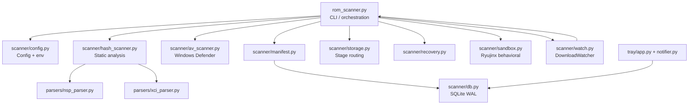

# AGENTS.md

This file provides guidance to Verdent when working with code in this repository.

## Table of Contents
1. [Commonly Used Commands](#commands)
2. [High-Level Architecture & Structure](#architecture)
3. [Key Rules & Constraints](#key-rules--constraints)
4. [Development Hints](#development-hints)

---

## Commands

```bash
# Install in editable mode with all extras
pip install -e ".[dev,tray]"

# Lint (scoped — do NOT run ruff on repo root)
python -m ruff check rom_scanner.py scanner parsers tray tests

# Type-check (Pyrefly, not mypy)
python -m pyrefly check rom_scanner.py scanner parsers tray tests --output-format=github

# Run all tests
python -m pytest tests/ -v

# Run a single test file
python -m pytest tests/test_hash_scanner.py -v

# Run a single test by name
python -m pytest tests/test_db.py::test_concurrent_writes -v

# Initialise a pipeline home (required before most commands)
python rom_scanner.py init

# Full ingest (copy → scan → route)
python rom_scanner.py ingest <file.nsp>

# Standalone static scan (no pipeline move)
python rom_scanner.py scan <file.nsp>

# Quick scan (no VirusTotal)
python rom_scanner.py quick <file.nsp>

# Watch Sandboxie downloads folder (blocking)
python rom_scanner.py watch [--daemon]

# Show pipeline manifest
python rom_scanner.py status [--stage approved]

# Export manifest to JSON
python rom_scanner.py export --format json
```

---

## Architecture

- **`rom_scanner.py`** — CLI entry point; all `argparse` subcommand routing lives here. Thin orchestration layer: calls into `scanner/` and `parsers/` but owns no domain logic.
- **`scanner/config.py`** — Single source of config truth. Loads `config.json`, merges env overrides, and caches at module level (`_config_cache`). Default pipeline root: `C:\RomScanner`.
- **`scanner/hash_scanner.py`** — Core static analysis engine. Dispatches to the right parser, queries VirusTotal (`urllib` only, no `requests`), checks local `threat_db.json`, and computes a weighted `risk_score ∈ [0, 1.0]`. `overall_safe = risk < 0.3 and not overall_suspicious`.
- **`scanner/av_scanner.py`** — Windows Defender wrapper (`MpCmdRun.exe`). Fail-closed: any error, timeout, or non-zero exit → treat as detected. No-ops silently on Linux.
- **`parsers/nsp_parser.py`** / **`parsers/xci_parser.py`** — Binary PFS0/HFS0 parsers with strict sanity limits (max 10 000 file entries, max 10 MB string table). Hash every file entry in 64 KB chunks.
- **`scanner/db.py`** — SQLite WAL backend (`scans.db`). All manifest I/O goes through here. One-time auto-migration from legacy `manifest.json` on first `init_db()` if DB is empty.
- **`scanner/manifest.py`** — Thin adapter over `db.py`; converts `ContainerReport` → DB row.
- **`scanner/storage.py`** — File routing between the four pipeline stages (`incoming → scanning → approved | quarantined`). `unique_dest()` prevents collisions by appending `_N` suffixes.
- **`scanner/recovery.py`** — On startup, re-queues or quarantines any files left in `scanning/` from a prior crash.
- **`scanner/sandbox.py`** — Behavioral analysis via Ryujinx. Diffs network state (netstat/ss) and temp-dir FS before/after emulator run.
- **`scanner/watch.py`** — Poll-based `DownloadWatcher` for Sandboxie downloads. Skips partial files (`.crdownload`, `.tmp`, `.part`, `.download`); stabilises on unchanged size for `stable_size_sec`.
- **`tray/`** — Optional Windows-only tray app (`pystray` + `Pillow`). Polls `scans.db` for notifications. Not required for core pipeline operation.

### Key data flow

```
External file
     │
     ▼
 watch.py (DownloadWatcher)
     │  stable file detected
     ▼
 rom_scanner._ingest_path()
     │
     ├─► storage.move_from_external() → incoming/
     │
     ├─► storage.move_to_stage()      → scanning/
     │
     ├─► av_scanner.scan_file()       (Windows Defender)
     │
     ├─► hash_scanner.HashScanner.scan_file()
     │       ├─ parsers/nsp_parser or xci_parser
     │       ├─ threat_db.json lookup
     │       └─ VirusTotal API (optional)
     │
     ├─► _route_verdict()
     │       ├─ risk < threshold  → approved/
     │       └─ risk ≥ threshold  → quarantined/
     │
     ├─► manifest.record_scan()       → scans.db
     │
     └─► [optional] sandbox.run_sandbox()
```

### External dependencies

| Dependency | Where used | Required? |
|------------|-----------|-----------|
| VirusTotal API v3 | `hash_scanner.py` | No — skipped if no API key |
| Windows Defender (`MpCmdRun.exe`) | `av_scanner.py` | No — silently skipped on Linux / `ROM_SCANNER_DEFENDER_SCAN=0` |
| Ryujinx emulator | `sandbox.py` | No — sandbox command only |
| Sandboxie-Plus | `watch.py`, `cmd_launch_chrome` | No — watch command only |
| `pystray`, `Pillow` | `tray/` | No — optional extra `[tray]` |

Core pipeline has **zero non-stdlib runtime dependencies**.

### Subsystem relationships



---

## Key Rules & Constraints

### Pipeline & safety
- **Fail-closed everywhere**: Defender error → quarantine; parse failure → quarantine; scan interrupted → `recovery.py` re-queues or quarantines. Never silently approve on uncertainty.
- **`scanning/` is the crash boundary**: files in `scanning/` on startup are orphans; `recover_orphans()` is always called at startup in `_run_recovery()`.
- **Routing threshold**: `risk_score < config["scan"]["risk_threshold"]` (default `0.3`) → `approved/`; otherwise → `quarantined/`. Do not hardcode `0.3`.
- **`overall_safe`** is the canonical boolean verdict on `ContainerReport`; it requires *both* `risk_score < 0.3` and `not overall_suspicious`.

### Config & environment
- **`_config_cache`** is a module-level cache in `scanner/config.py`. Tests must reset it via `config._config_cache = None` (the `reset_config_cache` fixture does this). Failing to reset causes test pollution.
- Env overrides take precedence over `config.json`: `ROM_SCANNER_HOME`, `VIRUSTOTAL_API_KEY`, `ROM_SCANNER_DEFENDER_SCAN=0`.
- Default pipeline home is `C:\RomScanner`; never assume a specific path in tests — use the `pipeline_home` fixture.

### Parsers
- PFS0/HFS0 parsers enforce hard limits: **>10 000 file entries → reject**, **string table >10 MB → reject**, **truncated table → reject**. Do not relax these bounds.
- All file entry hashing is chunked at **64 KB** — do not load entire entries into memory.
- Suspicious extensions inside containers: `.exe`, `.dll`, `.bat`, `.ps1`, `.vbs`, `.sh`, `.cmd`.

### Database
- Always use `db.py`'s `_connect()` context manager; it sets WAL mode, `foreign_keys=ON`, and 30 s timeout. Never open `scans.db` with a raw `sqlite3.connect()`.
- JSON migration (`manifest.json → scans.db`) runs once inside `init_db()` and is idempotent. Do not trigger it outside of `init_db()`.

### Tests
- All test fixtures are **100% synthetic** — `conftest.py` builds real binary PFS0/HFS0 blobs with `struct.pack`. Never commit real ROM files. [inferred: fixtures/README.md confirms this]
- Defender is disabled in tests via `monkeypatch.setenv("ROM_SCANNER_DEFENDER_SCAN", "0")`.
- VirusTotal is always mocked in tests via `unittest.mock.patch("scanner.hash_scanner.urlopen")`.
- `pipeline_home` uses `tmp_path` — never use a real filesystem path in tests.

### Linting / type-checking
- Ruff is scoped: `rom_scanner.py scanner parsers tray tests` — **do not run on repo root** (avoids linting `.pipeline-test/`, `scripts/`).
- Type checker is **Pyrefly**, not mypy. Do not add `mypy` or `pyright` config.
- `ruff.lint.ignore = ["E501"]` — line length is enforced via `line-length = 100` setting, not the E501 rule. Don't add E501 back.

### Platform
- `av_scanner.py` and `tray/` are Windows-only. Both guard with `sys.platform != "win32"` and no-op/exit gracefully on Linux. CI runs on `ubuntu-latest` — Defender calls must never hard-fail on Linux.
- `sandbox.py` uses `netstat` (Windows) or `ss` (Linux) — preserve both code paths.

---

## Development Hints

### Adding a new CLI subcommand
1. Write the handler function `cmd_<name>(args)` in `rom_scanner.py`.
2. Add a subparser under `subparsers` in `main()`.
3. Set `parser_<name>.set_defaults(func=cmd_<name>)`.
4. Add an integration test in `tests/test_integration.py`.

### Adding a new stage or routing rule
1. Add the stage name to `STAGE_NAMES` in `scanner/storage.py`.
2. Update `ensure_layout()` to create the directory.
3. Add a DB migration in `scanner/db.py` if the schema needs a new value in the `stage` column's allowed set.
4. Update `_route_verdict()` in `rom_scanner.py`.

### Extending risk scoring
- Risk logic lives entirely in `HashScanner._compute_risk_score()` in `scanner/hash_scanner.py`.
- Add new weighted terms; keep the cap at `min(1.0, score)`.
- Add a parametrized test in `tests/test_hash_scanner.py` using the VT mocking pattern already present.

### Adding a new file format (e.g., `.nca`)
1. Create `parsers/nca_parser.py` following the `NSPParser` pattern (dataclasses, 64 KB chunk hashing, hard entry/table limits).
2. Add a dispatch branch in `HashScanner.scan_file()` in `scanner/hash_scanner.py`.
3. Add parser tests in `tests/test_nca_parser.py` using synthetic binary fixtures.

### Modifying the SQLite schema
1. Add a new column with a default value in `init_db()` using `ALTER TABLE ... ADD COLUMN ... DEFAULT ...` inside `_migrate_json_manifest()` or a new `_migrate_vN()` helper.
2. Update `record_entry()`, `update_entry()`, and `export_json()` in `scanner/db.py`.
3. Add/update tests in `tests/test_db.py`.

### Modifying CI/CD (`.github/workflows/ci.yml`)
- Ruff and Pyrefly are run as `python -m ruff` / `python -m pyrefly` (not via `uvx` or standalone binaries) so they use the same venv as the project.
- Pytest runs with `-v`; do not add `--exitfirst` or `-x` to CI — all tests must run.
- If adding a new tool, add it to `[project.optional-dependencies] dev` in `pyproject.toml` first.

### Working with `threat_db.json`
- Lives at `scanner/threat_db.json`; currently empty (`{"sha256": [], "md5": []}`).
- To add known-bad hashes, append to the respective list. The file is loaded once per `HashScanner` instantiation — no hot reload.
- Tests that exercise threat DB matching must mock or write to a temp copy; do not modify the committed file in tests.

### Running the tray app in development
```bash
pip install -e ".[tray]"
python -c "from tray.app import main; main()"
```
Requires Windows. On Linux this will exit with a warning — expected behaviour.
