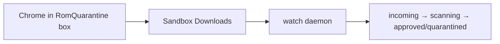

# Sandboxie-Plus Setup for ROM Scanner

ROM Scanner uses **Sandboxie-Plus** to isolate Chrome downloads. NSP/XCI files land in a sandbox-only Downloads folder; the `watch` daemon ingests them into the scan pipeline without touching your normal Desktop or Documents folders.

## Prerequisites

- Windows 10/11
- [Sandboxie-Plus](https://github.com/sandboxie-plus/Sandboxie-Plus/releases) installed (default: `C:\Program Files\Sandboxie-Plus\`)
- ROM Scanner installed: `pip install -e ".[tray]"` or run `scripts\install.ps1`

## 1. Install Sandboxie-Plus

1. Download the latest Sandboxie-Plus installer from GitHub releases.
2. Install with default options (requires administrator approval for the driver).
3. Confirm `Start.exe` exists at:
   ```
   C:\Program Files\Sandboxie-Plus\Start.exe
   ```

## 2. Create the RomQuarantine sandbox

Copy the template INI from this repository:

```
config/sandboxie/RomQuarantine.ini
```

Into your Sandboxie configuration folder (typical path):

```
C:\ProgramData\Sandboxie-Plus\RomQuarantine.ini
```

Or create the box manually in Sandboxie-Plus with these settings:

| Setting | Value |
|---------|-------|
| Box name | `RomQuarantine` |
| File root | `C:\RomScanner\sbx\RomQuarantine` (or your `ROM_SCANNER_HOME\sbx\RomQuarantine`) |
| Force process | `chrome.exe` |
| Write access | `%Downloads%\` only |
| Closed paths | Desktop, Personal, and other user profile folders outside the sandbox |

The sandbox should **not** allow writes to your real Downloads folder.

## 3. Configure ROM Scanner

Run initialization (creates directories and default `config.json`):

```powershell
rom-scanner init
```

Verify `config.json` under `ROM_SCANNER_HOME` (default `C:\RomScanner`):

```json
{
  "sandboxie": {
    "box_name": "RomQuarantine",
    "downloads_path": "C:/RomScanner/sbx/RomQuarantine/user/current/Downloads",
    "start_exe": "C:/Program Files/Sandboxie-Plus/Start.exe"
  }
}
```

Adjust `downloads_path` if your Sandboxie file root differs between versions.

## 4. Launch sandboxed Chrome

From the CLI or system tray:

```powershell
rom-scanner launch-chrome
```

This runs:

```
Start.exe /box:RomQuarantine chrome.exe
```

Chrome opens inside the `RomQuarantine` box. Downloads go to the sandbox Downloads path, not your normal profile.

## 5. Start the watch daemon

The watch daemon polls the sandbox Downloads folder and ingests completed NSP/XCI files:

```powershell
rom-scanner watch
```

For background operation (recommended):

```powershell
rom-scanner watch --daemon
```

Or use `scripts\install.ps1`, which registers a Task Scheduler job at logon.

## Workflow summary



1. Launch sandboxed Chrome (`launch-chrome` or tray menu).
2. Download NSP/XCI inside that Chrome session.
3. `watch` waits until the file size is stable, then moves it into the pipeline.
4. On approval, the sandbox source file is removed; on quarantine it may be deleted or retained per config.

## Troubleshooting

| Problem | Fix |
|---------|-----|
| `Start.exe` not found | Set `sandboxie.start_exe` in `config.json` to the correct path |
| Downloads not appearing in watch path | Open Sandboxie-Plus → RomQuarantine → explore sandbox → confirm Downloads path matches `downloads_path` |
| `.crdownload` never ingested | Wait for Chrome to finish; watch skips partial downloads |
| Chrome opens outside sandbox | Confirm box name is `RomQuarantine` and INI is loaded; restart Sandboxie service |
| Permission denied on move | Run `rom-scanner init` to create `sbx` layout; check Sandboxie file access rules |

## Security notes

- Only download ROMs you have the right to possess (your own cartridge dumps).
- Treat `approved/` as the only safe library for Ryujinx; never run files from `incoming/` or `quarantined/`.
- Sandboxie isolates **downloads**, not emulator execution — Ryujinx should load only from `approved/`.
